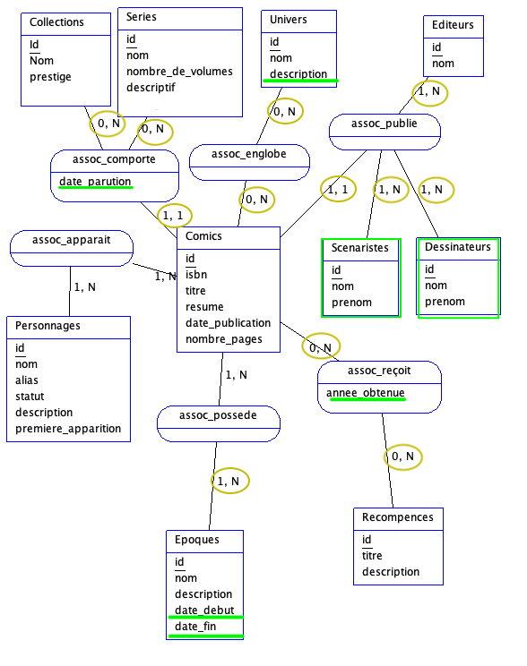
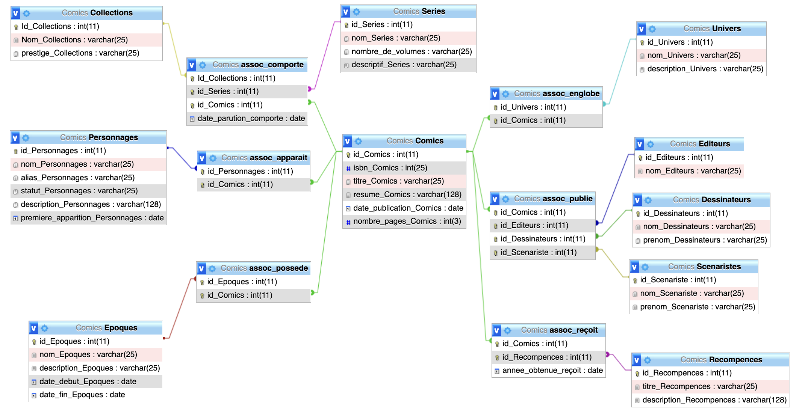

# Exercice - MCD Comics
En utilisant les informations du MCD. Vous devez procéder aux corrections qui vous semblent nécessaires. Puis créer la base de données sous MySQL.


## Modification faites sur le MCD


Ci-dessus en vert les modifications concernant les tables et en marron les cardinalités

### Les cardinalités
Un comics peut appartenir à une seule collection ou série.
Une collection peut comporter aucun ou plusieurs comics
Une série peut comporter aucun ou plusieurs comics

Un comics peut appartenir aucun ou plusieurs univers
Un univers peut englober aucun ou plusieurs univers

Un comics appartient à un seul éditeur, un seul scénariste, un seul dessinateur
Un éditeur possède 1 ou plusieurs Comics
Un scénariste possède 1 ou plusieurs Comics
Un dessinateur possède 1 ou plusieurs Comics

Un comics reçoit aucune ou plusieurs récompenses
Une récompense est reçue par aucun ou plusieurs comics

Un comics possède une ou plusieurs époques
Une époque peut posséder par un ou plusieurs comics

Un comics possède plusieurs personnages.
Un personnage apparaît dans un ou plusieurs comics

### Nouvelles tables
Deux nouvelles tables ont été créées pour les scénaristes et dessinateurs. Ceux-ci étaient des champs dans la table "comics".

## MPD

Ci dessus le Modèle Physique de Données 

## Script SQL
``` sql
DROP TABLE IF EXISTS Collections ;
CREATE TABLE Collections (Id_Collections INT AUTO_INCREMENT NOT NULL,
Nom_Collections VARCHAR(25),
prestige_Collections VARCHAR(25),
date_parution_Collections VARCHAR(25),
PRIMARY KEY (Id_Collections)) ENGINE=InnoDB;

DROP TABLE IF EXISTS Personnages ;
CREATE TABLE Personnages (id_Personnages INT AUTO_INCREMENT NOT NULL,
nom_Personnages VARCHAR(25),
alias_Personnages VARCHAR(25),
statut_Personnages VARCHAR(25),
description_Personnages VARCHAR(128),
premiere_apparition_Personnages DATE,
PRIMARY KEY (id_Personnages)) ENGINE=InnoDB;

DROP TABLE IF EXISTS Series ;
CREATE TABLE Series (id_Series INT AUTO_INCREMENT NOT NULL,
nom_Series VARCHAR(25),
nombre_de_volumes VARCHAR(25),
descriptif_Series VARCHAR(25),
date_parution_Series VARCHAR(25),
PRIMARY KEY (id_Series)) ENGINE=InnoDB;

DROP TABLE IF EXISTS Comics ;
CREATE TABLE Comics (id_Comics INT AUTO_INCREMENT NOT NULL,
isbn_Comics INTEGER(25),
titre_Comics VARCHAR(25),
resume_Comics VARCHAR(128),
date_publication_Comics DATE,
nombre_pages_Comics INTEGER(3),
PRIMARY KEY (id_Comics)) ENGINE=InnoDB;

DROP TABLE IF EXISTS Univers ;
CREATE TABLE Univers (id_Univers INT AUTO_INCREMENT NOT NULL,
nom_Univers VARCHAR(25),
description_Univers VARCHAR(25),
PRIMARY KEY (id_Univers)) ENGINE=InnoDB;

DROP TABLE IF EXISTS Epoques ;
CREATE TABLE Epoques (id_Epoques INT AUTO_INCREMENT NOT NULL,
nom_Epoques VARCHAR(25),
description_Epoques VARCHAR(25),
date_debut_Epoques DATE,
date_fin_Epoques DATE,
PRIMARY KEY (id_Epoques)) ENGINE=InnoDB;

DROP TABLE IF EXISTS Recompences ;
CREATE TABLE Recompences (id_Recompences INT AUTO_INCREMENT NOT NULL,
titre_Recompences VARCHAR(25),
description_Recompences VARCHAR(128),
PRIMARY KEY (id_Recompences)) ENGINE=InnoDB;

DROP TABLE IF EXISTS Editeurs ;
CREATE TABLE Editeurs (id_Editeurs INT AUTO_INCREMENT NOT NULL,
nom_Editeurs VARCHAR(25),
PRIMARY KEY (id_Editeurs)) ENGINE=InnoDB;

DROP TABLE IF EXISTS Scenaristes ;
CREATE TABLE Scenaristes (id_Scenariste INT AUTO_INCREMENT NOT NULL,
nom_Scenariste VARCHAR(25),
prenom_Scenariste VARCHAR(25),
PRIMARY KEY (id_Scenariste)) ENGINE=InnoDB;

DROP TABLE IF EXISTS Dessinateurs ;
CREATE TABLE Dessinateurs (id_Dessinateurs INT AUTO_INCREMENT NOT NULL,
nom_Dessinateurs VARCHAR(25),
prenom_Dessinateurs VARCHAR(25),
PRIMARY KEY (id_Dessinateurs)) ENGINE=InnoDB;

DROP TABLE IF EXISTS assoc_comporte ;
CREATE TABLE assoc_comporte (Id_Collections INT AUTO_INCREMENT NOT NULL,
id_Series INT NOT NULL,
id_Comics INT NOT NULL,
date_parution_comporte DATE,
PRIMARY KEY (Id_Collections,
 id_Series,
 id_Comics)) ENGINE=InnoDB;

DROP TABLE IF EXISTS assoc_reçoit ;
CREATE TABLE assoc_reçoit (id_Comics INT AUTO_INCREMENT NOT NULL,
id_Recompences INT NOT NULL,
annee_obtenue_reçoit DATE,
PRIMARY KEY (id_Comics,
 id_Recompences)) ENGINE=InnoDB;

DROP TABLE IF EXISTS assoc_englobe ;
CREATE TABLE assoc_englobe (id_Univers INT AUTO_INCREMENT NOT NULL,
id_Comics INT NOT NULL,
PRIMARY KEY (id_Univers,
 id_Comics)) ENGINE=InnoDB;

DROP TABLE IF EXISTS assoc_publie ;
CREATE TABLE assoc_publie (id_Comics INT AUTO_INCREMENT NOT NULL,
id_Editeurs INT NOT NULL,
id_Dessinateurs INT NOT NULL,
id_Scenariste INT NOT NULL,
PRIMARY KEY (id_Comics,
 id_Editeurs,
 id_Dessinateurs,
 id_Scenariste)) ENGINE=InnoDB;

DROP TABLE IF EXISTS assoc_possede ;
CREATE TABLE assoc_possede (id_Epoques INT AUTO_INCREMENT NOT NULL,
id_Comics INT NOT NULL,
PRIMARY KEY (id_Epoques,
 id_Comics)) ENGINE=InnoDB;

DROP TABLE IF EXISTS assoc_apparait ;
CREATE TABLE assoc_apparait (id_Personnages INT AUTO_INCREMENT NOT NULL,
id_Comics INT NOT NULL,
PRIMARY KEY (id_Personnages,
 id_Comics)) ENGINE=InnoDB;

ALTER TABLE assoc_comporte ADD CONSTRAINT FK_assoc_comporte_Id_Collections FOREIGN KEY (Id_Collections) REFERENCES Collections (Id_Collections);

ALTER TABLE assoc_comporte ADD CONSTRAINT FK_assoc_comporte_id_Series FOREIGN KEY (id_Series) REFERENCES Series (id_Series);
ALTER TABLE assoc_comporte ADD CONSTRAINT FK_assoc_comporte_id_Comics FOREIGN KEY (id_Comics) REFERENCES Comics (id_Comics);
ALTER TABLE assoc_reçoit ADD CONSTRAINT FK_assoc_reçoit_id_Comics FOREIGN KEY (id_Comics) REFERENCES Comics (id_Comics);
ALTER TABLE assoc_reçoit ADD CONSTRAINT FK_assoc_reçoit_id_Recompences FOREIGN KEY (id_Recompences) REFERENCES Recompences (id_Recompences);
ALTER TABLE assoc_englobe ADD CONSTRAINT FK_assoc_englobe_id_Univers FOREIGN KEY (id_Univers) REFERENCES Univers (id_Univers);
ALTER TABLE assoc_englobe ADD CONSTRAINT FK_assoc_englobe_id_Comics FOREIGN KEY (id_Comics) REFERENCES Comics (id_Comics);
ALTER TABLE assoc_publie ADD CONSTRAINT FK_assoc_publie_id_Comics FOREIGN KEY (id_Comics) REFERENCES Comics (id_Comics);
ALTER TABLE assoc_publie ADD CONSTRAINT FK_assoc_publie_id_Editeurs FOREIGN KEY (id_Editeurs) REFERENCES Editeurs (id_Editeurs);
ALTER TABLE assoc_publie ADD CONSTRAINT FK_assoc_publie_id_Dessinateurs FOREIGN KEY (id_Dessinateurs) REFERENCES Dessinateurs (id_Dessinateurs);
ALTER TABLE assoc_publie ADD CONSTRAINT FK_assoc_publie_id_Scenariste FOREIGN KEY (id_Scenariste) REFERENCES Scenaristes (id_Scenariste);
ALTER TABLE assoc_possede ADD CONSTRAINT FK_assoc_possede_id_Epoques FOREIGN KEY (id_Epoques) REFERENCES Epoques (id_Epoques);
ALTER TABLE assoc_possede ADD CONSTRAINT FK_assoc_possede_id_Comics FOREIGN KEY (id_Comics) REFERENCES Comics (id_Comics);
ALTER TABLE assoc_apparait ADD CONSTRAINT FK_assoc_apparait_id_Personnages FOREIGN KEY (id_Personnages) REFERENCES Personnages (id_Personnages);
ALTER TABLE assoc_apparait ADD CONSTRAINT FK_assoc_apparait_id_Comics FOREIGN KEY (id_Comics) REFERENCES Comics (id_Comics);

```
